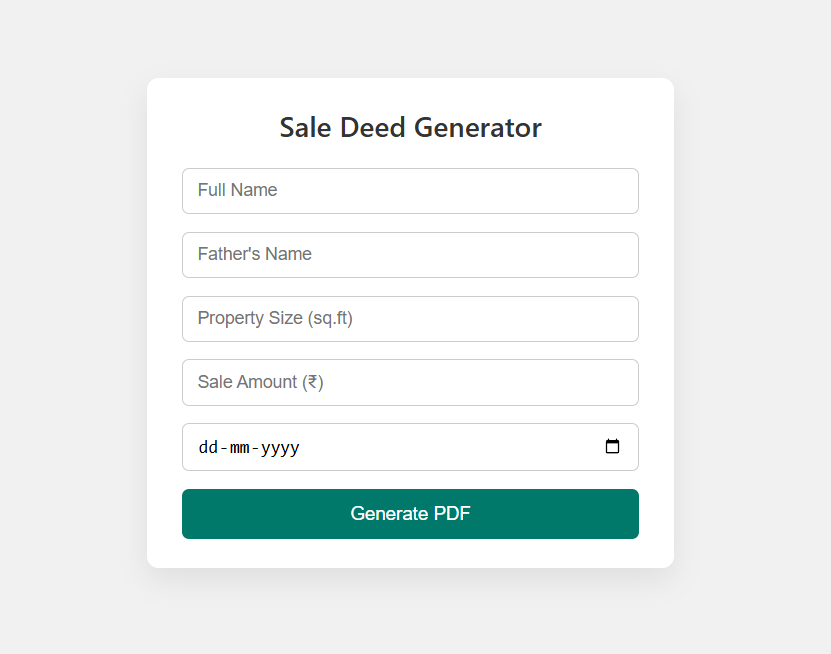
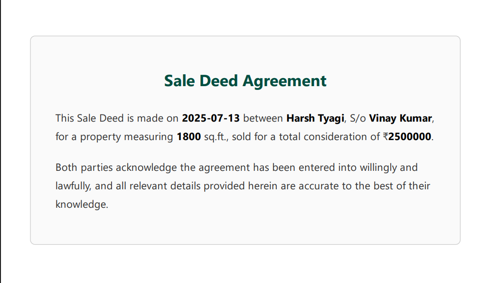

# 📄 Sale Deed PDF Generator

This project allows users to fill a form with basic property details and generate a professional **PDF sale deed** dynamically using HTML templates and `html-pdf`.

---

## ✨ Features

- Simple, centered form with clean UI
- Auto-fills an HTML sale deed template with user input
- Generates a downloadable **PDF** with formatted content
- Built with: `Node.js`, `Express`, `html-pdf`

---

## 🖼️ Preview

### 🧾 Form UI


### 📄 Generated PDF Content


> These screenshots show sample data filled by the user.

---

## 🚀 How to Run

1. Clone this repository or download ZIP  
2. Install dependencies:

```bash
npm install
```

3. Start the server:

```bash
node server.js
```

4. Visit: `http://localhost:3000`  
5. Fill out the form → click **Generate PDF** → your download will begin

---

## 📁 Folder Structure

```
project-root/
│
├── public/            # Frontend (index.html, index.css, form image)
├── templates/         # HTML template with placeholders
├── generated/         # Output folder for saved PDFs
├── server.js          # Main Express server
└── README.md
```

---

## 📌 Sample Data

| Field           | Sample Value          |
|----------------|------------------------|
| Full Name       | Harsh Tyagi           |
| Father's Name   | Vinay Kumar           |
| Property Size   | 1800                  |
| Sale Amount     | 2500000               |
| Date            | 2025-07-13            |
